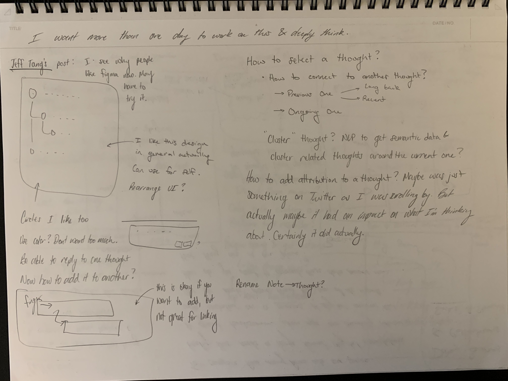
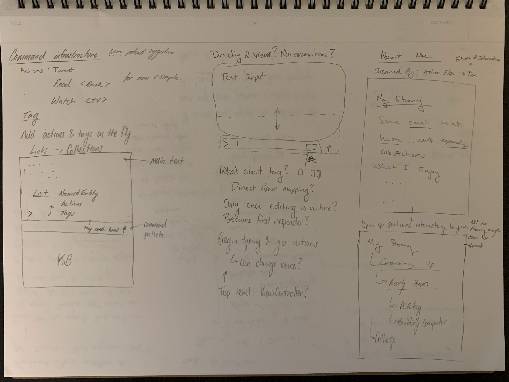

# Project Status 0.02

Mostly cleanup from the mess I created the past two weeks 😊 

## What was done

So let's pull it from last week and find out

### Last Weeks Goals

* [x] **Code Cleanup**
  * Rethink about the Environment: **Eh not really, just using it a lot more..** 
  * Compartmentalize Views better: **Yep and reorganized**
  * Work on `CoreData` and add more info for displaying dynamically
    * **Hacked the shit out of my DB to get dates separator in. Will change this in the future**
  * Fix `TextInput` overlapping with rest of UI. Also dynamically limit the `frame maxHeight` based on device.
    * **Yep, it moves properly now**
    * Remove hardcoded values here, probably some stuff to save in the env \(seems hacky but will work for now to make it nice looking\)
      * **Not really, some more were removed, but lots is still there. GeometryReader...**
  * Create a rotated and flipped view to do a lot of this flipping without manually specifying, or create and `extension` to `View` for this.
    * **Yep, created an extension to View as specified. \(View.flip\(\)\)**
* [x] **Start Writing Podcast App**
  * **Yep, play and pause Audio from a stream and interact with it from the CommandCenter**
  * **Waiting on API confirmation from ListenNotes**
* [ ] **Start using issue/project tracker to figure out these timelines and be able to sort through them as well. This might be an entire input method on the app itself. FR feature request lol, I will be requesting features from my future self** 😈 
  * [ ] **NOPE. This will go further in the future,... Not really important right now. Might stop trying to track future changes as carefully for now. Mostly I am just playing with Swift/iOS Dev, no need to get involved with timelines. I have only 1 day a week to work on right now.**

### Detail & Things I Learned

There's not a whole lot to write on the App side of things this week. Most of it was just cleanup. Some details for the podcast player and things I've learned

* Went through to request Twitter API Credentials for future usage
* Requested for ListenNotes API Credentials
* Rename Views and organize them
* Work on experimental View `CommandPalette`
  * For autocompleting commands, adding tags, semantic search, etc
  * Play with animations
* Add date break
  * On app start go through DB and check if the day has changed between two thoughts, if so add boolean flag to `CoreData`. UI will check this flag and set up the date separator accordingly
* Fix `TextInput` appearing over `ConversationView`
  * Adjust the frame height of the `ConversationView`. Needed to modify the `Environment`
* Work on Podcast App
  * Stream Audio with `AVPlayer`
    * Media controls
    * Callback to update UI information when a tick fires
  * Create `AVAudioSession` and link it into system AV
  * Add `MPRemoteCommandCenter` to hook into Command Center for Lockscreen and Device
  * Add permissions to run in the background
* Research on how to get apps to share common data and do IPC
  * Looks like we can do this on iOS/MacOS using Application Groups
    * This is like a common sandbox or something. Interested to use this.

### Demo



## Drawings & Inspiration From This Week





## What's Next?

* If ListenNotes API, then use it to build podcast App
  * Otherwise create some static list with basic WebUI to add podcasts to and use this to sync which ones I'm subscribed to or something. Not sure exactly yet.
  * Also want subscribe for notifications, but also listen queue
    * Dynamically add things to top of the queue \(up first\)
* With basic podcast integration
  * Need the UI to have some kind of an indication that a podcast was playing or is playing.
    * Capture events on the podcast essentially. Will have to add a stop command as noted
    * Maybe similar to Date thing, do podcast... idk yet
    * Also need to be able to modify in the front of the app not just in the podcast portion
  * Will need to do similarly for the web. Might need to adjust how the text file is written
    * Write in date modifiers
    * Write in podcast modifiers
    * These modifiers can build some sort of context hierarchy or something
      * Maybe not just a blind append, but a \t or something
    * Maybe use UTF-8 blank characters to indicate certain things? Or emojis?
    * 📅Date
      * 🎙️Podcast
        * 💭Thought
      * **🎧**Music
      * **🏃**Running
      * **🚲**Biking
      * **🧗**Climbing
      * **🍔**Food
* Figure out a better system to log what is being done, maybe a lot of commits.
* If no podcast stuff then maybe start more work on the command palette and books
  * predict page based on time elapsed? over time?

