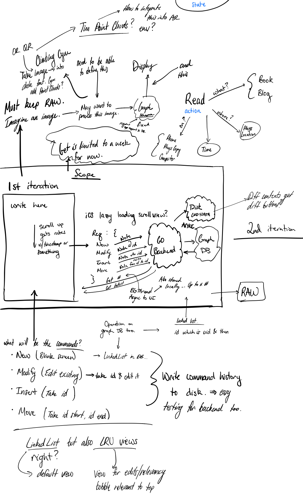

# Disappearing Notes

### yeah I'm developing an app

name tbd

## What is it?!

### A place for ideas \(and more!\)

This wiki page has helped me refine what I want. Right now all the writings have came from notes I've written in my Notes app on my phone. This is nice, but really not the interface I want. 

### What do I want

Okay I just want to enter this app and write then exit it. I want to have metadata surrounding what was written.

Also should be for time tracking things. see [this](https://julian.digital/)

### Whats the scope for 0.00?

#### To capture thoughts. To capture commands I want the system to handle in the future.

1. iOS App
   1. Lets you input text. On exit sends to a server via API
   2. Can view history by scrolling up. \(Default view is blank for input\)
2. API \(written in Go\) structure TBD. Also always write req to disk. Something like:
   1. New
   2. Modify
      1. edit text
      2. delete
   3. Insert \(this one's gonna be a pain for App\)
      1. Move
3. DB
   1. Some Graph DB. Probably [Neo4j](https://neo4j.com/) or [DGraph](https://dgraph.io/)
   2. Each node will contain basic data.
4. Dead simple web interface and stream/event viewer at stream.cjpais.com or similar

#### Super simple right?

No idea. Haven't written in Swift or for iOS except experimentation.

This is 0.00 because everything is likely going to change and I'm planning for it to.

### Whats 0.0x

I don't know this either. I do know some things though. I will be collecting data from:

* Strava
* iMessage \(running a script when the sqlitedb changes on my mac.`inotifywatch`\) 
* Spotify
* Apple Watch Data????

### After that?

**A lot.** The **implementation will change dramatically** once I know what it should handle.

It will be handling multiple contexts and navigating between them. Mostly all driven on the phone for now. The web interface should allow for exploration and more indepth writing. It should also be a website. This website likely will be its own thing too. Who knows yet. I dont. Will be a mostly gesture driven interface on the phone, eventually iPad version as well, but it will look & behave different than the phone version. Similar for the web. The design will be specifically targeted for each kind of device and use case. Maybe this will change in the future. I don't know because it needs to be usable first.

This will time track everything for me eventually and schedule reminders, future events, and allow for webpage generation. All kinds of things.

Everything is intended to be forked. Hope for a community and a community driven approach to data and semantics. 

### Will it be open source? 

### YES. Look out for the repo next week. \(All dev will be done saturday currently\)

## Inspiration









lots more \(like hundreds of ideas, these are the recent ones\)

## Scope Creep

Has been underlying this project for a long time. Maybe 3 years now? I have finally found a starting place?

### What's been creeping in this week?

Well there's been a lot. I can't cover it all without writing all day long

