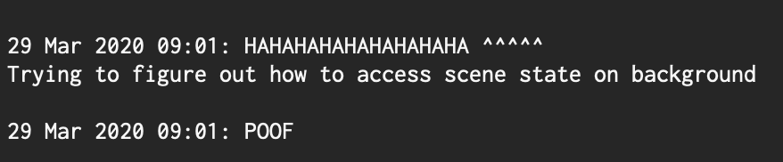

# Projects Status: 0.00

## Disappearing Notes

### We did it! The notes disappear!

Small victory. Most of what was set out to be accomplished got done. I reduced the scope even further and for now I am fine with this. For now it looks like it will serve my purpose just fine. I've dropped the DB for now and more complex insert/modify operations.

I focused and worked from 11AM-8PM yesterday. A banana was the only food other than my breakfast.

### **What was done + what I learned**

**Roughly in order \(documenting this a day later\)**

* Created new iOS/SwiftUI Project 'cjplay'
* Created "CardView"
  * Initially imagined would have a bunch of cards representing each note, but this ended up being a very ugly UI. The card and background are the same color now so you can't see the text is in a card.
* Found out that [SwiftUI TextField](https://developer.apple.com/documentation/swiftui/textfield) sucks ass. 
  * As of now it looks like multiline text with it is basically impossible??? wtf apple?
* Learned how to use UIViewRepresentable kind of. 
  * Created TextView which is a UIKit UITextView which is UIViewRepresentable.
    * With this I can do multiline stuff.
      * It has a bit of weirdness too \(that took way too long to figure out\). The field must be scrollable for it to wrap the text? Again I don't understand the design. These things should be mutually exclusive. I tried using specific wrapping parameters and that did shit all.
    * Can pass data in and out of it
* Learned about CoreData, created and used a Model
  * I needed to figure out how I could clear the note on the App being backgrounded. No idea how I could do this, but I figured with Core Data I could at least get the data out of the application using NSFetchRequest.
    * Turns out I can, but I have no idea how to bind this to my SwiftUI, so when the app resumes the old note is still there... ok fine.
  * Also I did something really dirty while using CoreData that I will remove. I was writing to the CoreData context in the UI thread. Lol this is horrible, I felt dirty just doing this, and the debugger clearly was telling me the same.
* At this time now I could at least get data out so I whipped up a simple go webserver
  * The API is /note/new, and takes Content-Type text/plain via POST
  * It appends the text to a file on the disk 'cj.txt'
  * Pretty sweet right?
* Implemented code to send POST with URLSession when Scene is backgrounded
* Well shit I can't clear my UI... 
  * I did a lot of reading at this point. Through the Docs, mostly surrounding UIScene.
  * Beyond this a lot of Googling to understand more what the hell is going on and how to get this data.
    * Some more experimenting with ObserableObjects, Enviornments, etc. I still don't quite understand. The abstraction is a bit strange to me, but it seems mostly to completely reside in SwiftUI land. Fine, we will let this be separated out from App Logic.
  * AppDelegate and SceneDelgate
    * What I didn't realize is the interaction between SceneDelegates and AppDelegates. Seems like the AppDelegate is the highest level for the app, and the scene is below that so parallel scenes can be supported in iPad OS. 
      * This is pretty important. The SceneDelegate has a reference to the app delegate.
      * I can store data at the AppDelegate level and the same data can be binded to my UI through Enviornment \(or something like that\).
        * This still seems quite hacky. Though it works and clears the scene great.
        * I think I might have to do something with UserData or something
        * Persisted data can continue to be in the CoreData model but I will have to extensively modify it for what I want \(will be decided more in **0.01**\)
* That's about all for now!

There was so much learned about Swift and SwiftUI. This took the majority of the time. I spent probably 5 hours trying to get the text field right. I encountered so many quirks and holes in my knowledge. I feel like now I have a grasp on some of the paradigms they are trying to set, but I don't quite understand them all. Everything is a bit too abstracted for my liking personally. I work in C all day long, and it is dead simple to read. Maybe I should have written an ObjectiveC app, but I think this would've led me down the same path in the sense that Apple is hiding so much from userland apps. I could be wrong because I have no idea. I've written ObjectiveC once about a year and a half ago.

### Demo



### Naming Scheme

Currently this will be a weekly release on Saturday. I work 5 days a week for long hours already and will not be making progress. Sunday is my free day to do whatever I'd like and Saturday is my day for code. Once the quarantine ends and my knee heals, this might be broken up a little more depending on what I have going on \(backpacking trips, rock climbing, etc\), but mostly this will be the schedule.

So with this we will do y.ww for now. So 0 is for the year, this is year 0. Will be using 0 based indexing because I feel like it. Similar for week. This is week 0.

If anything more gets done this will be y.ww.dd, don't expect this very often. Today might be an exception, but we'll see. Some other higher priority stuff.

### Some goals for 0.01

Some immediate things I am looking for/need to do. Some decisions are to be made and may not make it in this release. Looks like there's a lot of things to do in this release. I think we will get the simple things out of the way first \(\#1,2,3,4\). Then spend some time for podcasts, if doesn't work out shelve it for now. Move onto spotify. And messaging interface

1. Publish repo's with my toy code
2. Publish event stream @ stream.cjpais.com =&gt; moving server to web?
   1. yeah gonna need a good way to somewhat protect this :\)
   2. you wont have any kind of write access to my stream \(hopefully\), if it gets messed up I fucked up badly. Will make copies of this locally \(offline\)
   3. also this is basically going to entirely replace this site & twitter at some point. Create twitter like threads but more mesh like.
3. Change date formatting
4. How the hell to track these goals? All in github issue tracker? Here itself? It will be here eventually, so I will assign the version to be around **0.11** as I will certainly need it to be part of the system. 
5. Integrate spotify API
   1. **0.01+ ~ 0.03** start of event scheduler/message queue? 
6. Figure out if integrating podcasts is possible
   1. MPMediaPlayer? Looks like Apple and other services make way harder than necessary.
   2. **0.01+ ~ 0.05:** May end up having to integrate some kind of podcast player. I will need to be able at minimum to keep track of start and stop. I need this. My morning consists of listening to podcasts while I work out, shower, eat. I can go through as many as 3 or 4. I want to be able to capture associated notes.
7. Persist note for a little bit of time? 
   1. Schedule notification? 
   2. Only when app is explicitly exit from user clear the note? 
8. Create new 'thought' and make the old one go away?
   1. Want to be able to capture different trains of thought somewhat explicitly. Thought of in the shower this morning. Something like &gt; button. Can think of iMessage interface. Perhaps this is also a good interface here. Actually this is an interesting thought, to change the input down below. Instead of dissapear its a send. Will need to think more on this. Could also use something like color when showing the sent message to see how the system interpreted it. Could help to show some state in the application naturally. Will really have to think about this, could be interesting and better design paradigm.
   2. Could also have some notion of time 
      1. -------- Date ---------
      2. &lt;- time on the side? fixed always visible? other side? who knows? user pref? will probably just use some hacked up ui for myself initially.
   3. Display of context too? \(now playing, now reading, etc?\)
9. Alternative input methods \(voice recording, and photo/video integration\)?
10. Create app icon, thinking white on black or black on white circle, or circles. Would be kind of cool to have the center be a small circle created from a bunch of larger circles, seems v hard to make tho

### Goals 0.01+

These are all over the place but I will try to roughly estimate the week they will come in.

* **0.02:** Real data model using graph DB as backend? Continue to use text file? Will need to evaluate. Pros and cons to each side. 
* **0.03:** Probably some kind of user authentication... might even need to come earlier. 
* **0.04:** Start doing NLP server side. Basically want to do Named Entity Recognition. Give feedback on it on the desktop UI \(and maybe even mobile\). Such that it can be easily corrected as well \(like it doesn't pick up a clearly named entity, I can highlight it and tell it that its an entitiy\)
  * **0.10:** Will also want to be able to recognize other things than entities. Also actions/implied actions. For example last night I wrote "Goodnight" =&gt; I'm going to sleep. This morning I wrote "woke" =&gt; awake.
* **0.15:** More thinking about how 'apps' should interact with the backend system. Specifically after writing more Swift code. There are so many times I wish I could just pull some state from another system but I can't. Would like to know and interact with that state. But some state needs protection as well. Like it can be a blocking state in some sense. Only certain kinds of events can remove that blocking. Will have to see. Will need to protect from malicious intent, but also its all my code for now. Other code can be hooked in but only explicitly.
  * **0.32:** Some kind of package manager for my own sanity? This will mostly go on the server side, but could even be triggered from Application side. Will have to have the prior thinking done above.
  * **0.20:** Want to be able to have a solid picture of the model between other apps, or if its all just this one?
* **0.13:** podcast commenting system, maybe soundcloud like with annotations as well.. ala [https://twitter.com/adam\_keesling/status/1243647609874481152](https://twitter.com/adam_keesling/status/1243647609874481152)
* **0.10:** Establish some data model. I will be interacting with entities that are public, so I need to be able to link that data. Semantic web kind of concept. This can use WikiData or ConceptNet or similar. May be needed in NLP \(**0.04?** this is seeming a bit early now\)
  * Some kind of multi-tier system. Private, circles, and public? Can also be anon, but ideally these things. Anon is completely separate entity. Ideally something not comfortable saying, but is something vulnerable? This has so many problems tho given how people use anon interactions today. Maybe only real users can comment on an anon message? Anon to be implemented around **1.00+**
  * Might have to begin to write my own graph db, or at least begin to conceptualize about it. **Graph DB is a straight up research project.** It's like the fabric of everything

\*\*\*\*

\*\*\*\*

## 

