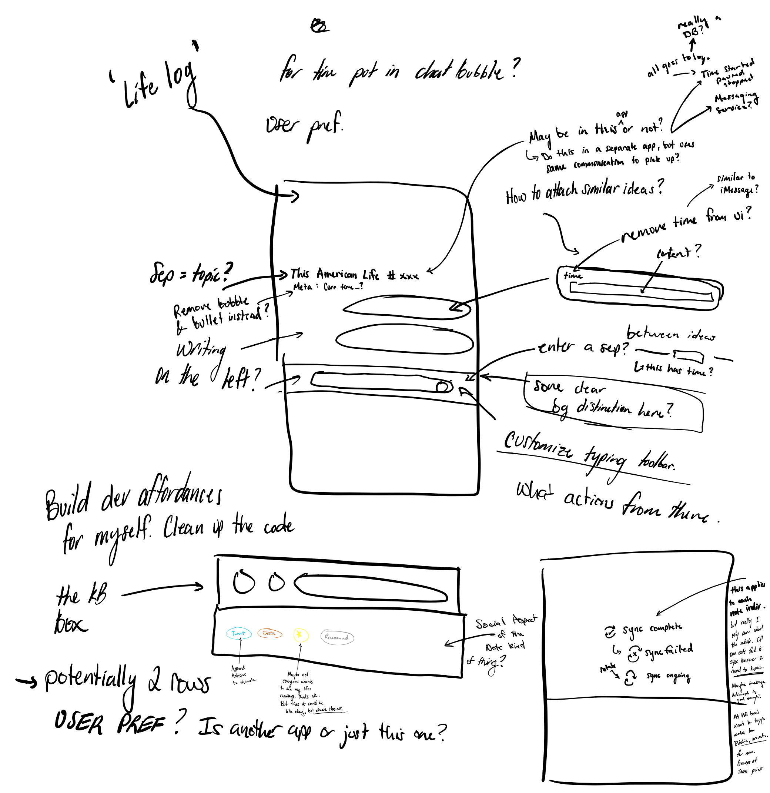

# Project Status 0.01

Some necessary improvements for the app. Pretty excited where it's at right now, it's at least a lot more usable. I think next week I will have even more thoughts on what needs improvement after using it for a bit.

### What was done

Let's go through last week's notes and check the things off. Overall did relatively ok. Mostly worked on the UI this week, it's quite a different experience now. Some [fun notes](project-status-0.01.md#detail-on-what-was-learned) along the way too.

* [x] Publish repo's with my toy code
  1. iOS Code: [https://github.com/cjpais/cjplay-ios](https://github.com/cjpais/cjplay-ios)
  2. Server Code: [https://github.com/cjpais/ubiquitous-journey](https://github.com/cjpais/ubiquitous-journey) \(lol name\)
* [x] Publish event stream @ [stream.cjpais.com](http://stream.cjpais.com/) =&gt; moving server to web?
* [x] Change date formatting
* [ ] How the hell to track these goals? All in github issue tracker? Here itself? It will be here eventually, so I will assign the version to be around **0.11** as I will certainly need it to be part of the system. 
  1. Nope. For now will keep the gitbook. I have most in my head for now.. Will need something else as this won't scale
* [ ] Integrate spotify API
  1. Nope. Not that worried about spotify for now move to **~0.10**
* [x] Figure out if integrating podcasts is possible
  1. It will be, but I will probably start writing another app for this. Maybe integrate into the main one or not. TBD **0.02**
* [x] Persist note for a little bit of time? 
  1. See the below
* [x] Create new 'thought' and make the old one go away? Something like &gt; button to send. iMessage like
* [x] -------- Date ---------
  1. Implemented in the code, not seen visually. Need more work **0.02**
* [x] &lt;- time on the side? fixed always visible? other side? who knows? user pref? will probably just use some hacked up ui for myself initially.
  1. Yup, see the [demo](project-status-0.01.md#demo). This is ugly and [will be revisited](project-status-0.01.md#sketches-from-this-week)
* [ ] Alternative input methods \(voice recording, and photo/video integration\)?
  1. Lets move this to **0.05**
* [ ] Create app icon, thinking white on black or black on white circle, or circles. Would be kind of cool to have the center be a small circle created from a bunch of larger circles, seems v hard to make tho
  1. Code is more important for me right now. It's on the mind but no tag.

### Demo



### How it was done and what was learned

A lot about SwiftUI it turns out. Ripped a lot of code out too, but tons still hanging around. After using the app for a week the biggest gripe I had was that I had to keep exiting the app to send something to the server. So this week we totally redid the UI

* **Build new UI**
  * Build "message input"
    * This was relatively simple, I already had the custom text view, so I just put some styling on it and a button
  * Add new `Note` to `CoreData`
    * Mostly this wasn't a huge issue, just moving around some code so when the button is pressed we also save the note locally. I mostly had the framework for this.
  * Send message to the server
    * Basically just ripped out the code from the app getting backgrounded and moved it to the button press handler.
  * Move display dynamically with keyboard open/close
    * This was a pain mostly because I had no idea what I am doing
    * After lots of Googling, when the UI appears \(`.onAppear()`\) I will add an observer for the `keyboardWillShow` notification. I will get the `height` of this.
    * The `height` will be used to change the `padding` of the last element to effectively shift up the whole UI up. Initially I used `offset`, but this ignores the safe area which causes problems \(ui overlaps with status stuff\)... The calculation includes the safe area to display the input at approximately the right place.
  * Start `ScrollView` from the bottom for chat like UI
    * This was a pain, but the solution was not horrible but quite hacky lol.
    * The problem is the `ScrollView` has no option to start a the bottom as far as I can gather.
      * So what to do? Well I found a suggestion and it was to flip the `ScrollView` 180 degrees. I tried this and actually it worked quite well. Sure you have to flip the inner view the same \(and mirror it, because now everything is opposite as you initially programmed\). But after doing that, it kind of just works.
      * Even adding data with `CoreData` into the view was no problem, it worked and shows the results immediately. Without flipping, this also would have needed to be taken care of manually. So this option was by far the easiest and I think the cost to the UI thread is relatively low, but I guess we will find out. Who knows though. This UI might not even last that long. 
    * [Answered StackOverflow Question](https://stackoverflow.com/questions/57258846/how-to-make-a-swiftui-list-scroll-automatically/61036551#61036551). I wasn't really satisfied with the implementations suggested. I found this suggestion in some StackOverflow post for `UIScrollView` using `CGAffineTransform`. I adapted the methodology for SwiftUI
  * Resize the `TextInput` dynamically according to it's contents height.
    * This just took a little bit of rejiggering the code to, so that the `frame` of the view changes dynamically as the contents of the `TextInput` change. There are definitely some hardcoded values here that will need to be removed. Probably should bring the iPhone 7 back to life.
* **Build the stream**
  * Allow new notes when not on local net
    * I had to open a port. Server is running on my Arch machine.
  * Get some VPS server to host static files
    * Written in Go
    * Need to serve HTTPS
    * Built minimal CSS
  * Built script to reverse the appended text file and output html & SCP to static serv
    * This is python for now
    * Called every time the server gets an update
  * Yeah this is a lot of components. Will need to make this way easier in the future, but for now it's simple enough.

### What's gonna be in 0.02?

I am thinking maybe do some code clean up in iOS. There are a lot of things about the code that I am not happy with right now. It is getting to be painful to work on. These are the growing pains when you have no idea what you're doing. I also want to set it up where I can work on individual components a little more carefully rather than running everything on my phone every time.

* **Code Cleanup**
  * Rethink about the Environment
  * Compartmentalize Views better
  * Work on `CoreData` and add more info for displaying dynamically
  * Fix `TextInput` overlapping with rest of UI. Also dynamically limit the `frame maxHeight` based on device.
    * Remove hardcoded values here, probably some stuff to save in the env \(seems hacky but will work for now to make it nice looking\)
  * Create a rotated and flipped view to do a lot of this flipping without manually specifying, or create and `extension` to `View` for this.
* **Start Writing Podcast App**
  * This is the biggest thing I want to add initially as mentioned before.
  * This will be a separate app for now? Maybe integrated into the same one to keep data together initially. Later this should be resolved, either by the server or some cross data storage \(i don't think ios will let me do that tho which is quite unfortunate, lets see\)
  * Subscribe to Podcasts
  * Get list in date order \(+be able to sort by importance to me\)
  * Play, Pause, and Stop
    * Why Stop?
      * Need some way of explicitly indicating to the computer that I don't want to write in this context
    * Log these out to file
    * In main UI reflect if the podcast is being listened to and the notes are going into that 'bucket'
  * Get transcript
    * if not provided. generate it \(force it through otter? lol\)
  * Be able to operate on transcript
    * make notes directly in the text
  * Jon's suggestion to pause podcast and record audio with custom airpod action
    * No direct Apple API, tho there is this github project [https://github.com/LemaMichael/AIR](https://github.com/LemaMichael/AIR)

### Sketches from this week

I do have some audio recordings/drawings as well. In the future I'd like to be able to add this to the stream. At some point maybe all the work for this is streamed.

### Things for 0.02+

**"31 Mar 2020 21:17: I just want a seamless experience where my thoughts are not interrupted"**

* **0.07** Alarm integration 
* **0.05** Audio/video input integration + transcription \(**~0.08?**\)
  * Want to be able to publish/live stream these things. **0.13**
* **0.04** Custom input toolbar, ability to also send a tweet when the note hits \(better to do this locally\)
* **0.04** Public vs Private notes
* **0.03** Think about parsing vs db + think about message queue too \(pub sub\)
* **0.03** Provide feedback based on state \(specifically around if it hit the server and if it hit the web\)
* **0.03** Think about app interaction with the backend. Unified backend
  * Thinking that even a text file is potentially enough as long as theres some kind of definite language to parse it. Basically add things, and things can refer back to other things, but doing this efficiently may be hard. Need some notion of 'pointers'

